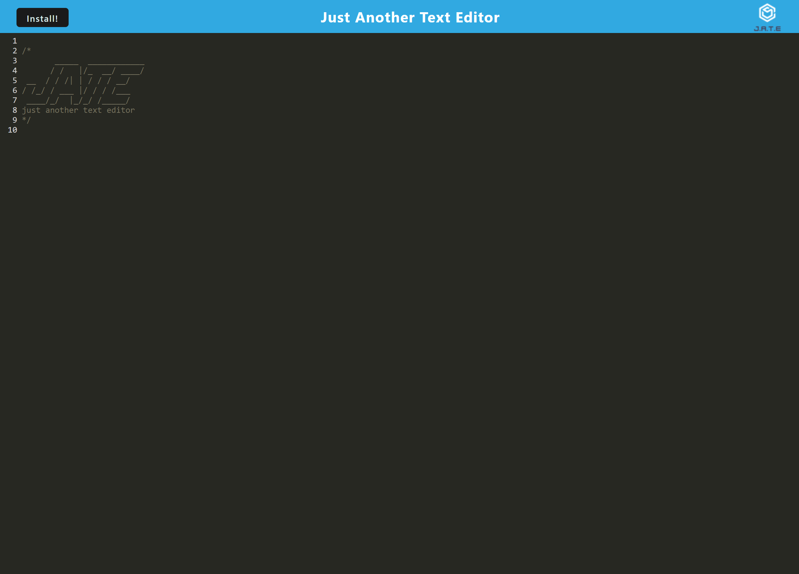

# textEditorPWA-Write-Stuff

## Description
This project is part of a coding bootcamp challenge with Kansas University, from Module 19 focusing on Progressive Web Applications (PWA): Text Editor. The majority of the code was provided, requiring only the construction of the 'dist' file through webpack.config.js and the service worker file src-sw.js, as well as the database handling via database.js. The project aims to demonstrate the capabilities of PWAs by creating a text editor that leverages modern web technologies for offline functionality, efficient asset caching, and seamless user experience.

## Table of Content
  * [Description](#description)
  * [Technologies](#technologies)
  * [Installation](#installation)
  * [License](#license)
  * [Resources](#resources)
  * [Deployment](#deployment)
  * [Questions](#questions)
  * [Contact](#contact)

## Technologies
This project used Node.js and all the basic technologies that implies with that but the ones that highlight here are:
* Webpack: A module bundler used for bundling JavaScript files and other assets. It's configured through webpack.config.js.
* Workbox: A set of libraries used for adding offline capabilities to web apps. It's used in the service worker file (src-sw.js) for caching strategies and routing.
* IndexedDB: A low-level API for storing large amounts of NoSQL structured data, including files and blobs. It's used for the database functionality through database.js.
* CodeMirror: A text editor implemented in JavaScript, used for providing the text editing capabilities.(It was originally provided).
* PWA (Progressive Web Apps): The overarching technology that allows the web app to have native-app-like capabilities such as offline access and asset caching.
* Service Workers: Used for handling background tasks like caching and push notifications. Defined in src-sw.js.
* Manifest File: Used for defining how the app appears when installed on a device, specified in manifest.json.

## Installation
After downloaded or cloned the files into a local directory. Execute the commands in the CLI.

* 'npm install' to install the dependencies.
* 'npm run dev' to run the built 'dist' file.
* Finnaly, 'npm run start' to initialize the server.

Open index.html in the dist file with Live Server.

## License

## Resources
* https://developer.mozilla.org/en-US/docs/Web/API/Service_Worker_API
* https://web.dev/learn/pwa/service-workers
* 

## Deployment
This will be a temporary deployment in Heroku.
  * https://text-editor-pwa-write-dbbcce847208.herokuapp.com/Este

  ## Contact
You can contact me through this account on GitHub.
